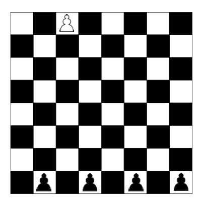

# Rókafogó játék

Rókafogó játék. A játék egy sakktáblán játszható 4 sötétés 1 világos gyaloggal, amelyek a kezdőállásban az ábrán látható módon helyezkednek el. A sötét gyalogok a kutyák, a világos gyalog a róka. Az egyik játékos a kutyákat, a másik a rókát irányítja. A játékosok felváltva következnek lépni:

- A kutyák átlósan léphetnek egy mezőt, de csak előre.
- A róka szintén átlósan egy mezőt léphet, de mozoghat hátrafelé is.

A rókát irányító játékos __akkor nyer__, ha a figurát a __kutyák mögé vezeti__. A kutyákat vezető játékos __akkor nyer, ha a rókát olyan helyzetbe kényszeríti, amelyben nem tud lépni.__ 

